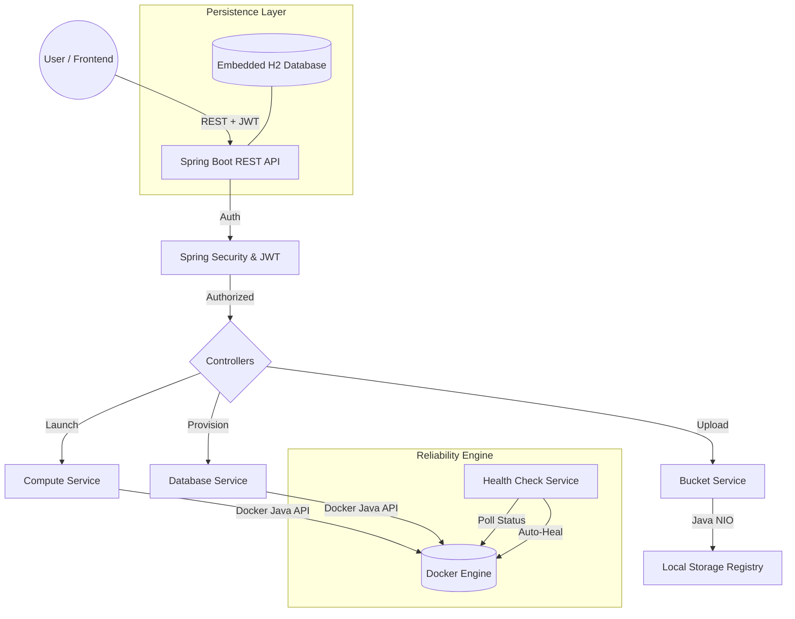

# ☁️ MiniCloud — Java-Based Cloud Infrastructure Platform

> A simplified, locally-running cloud platform that provides core infrastructure services — built entirely with a **Pure Java** tech stack as a professional Project-Based Learning initiative.

---

## 📌 Problem Statement

Modern cloud environments are powerful but often complex for developmental learning and local simulation. **MiniCloud** is a unified cloud console that exposes essential infrastructure primitives — Compute, Storage, Databases, Load Balancing, and Identity Management — using nothing but Java, Docker, and a modern Spring Boot backend. It provides a local "Private Cloud" experience for developers to host, scale, and monitor web services.

---

## 🚀 Core Infrastructure Services

| Service | Category | Functionality | Technology |
|---|---|---|---|
| **Compute** | Virtual Server | Host Tomcat web servers and custom applications | Docker Engine |
| **Object Storage** | Data Backup | Store files, assets, and media in buckets | Java NIO (`java.nio.file`) |
| **Managed Database** | DB Engine | Provision secure MySQL instances with dynamic ports | Docker (MySQL) |
| **Load Balancer** | Traffic Mgmt | Distribute incoming traffic across multiple servers | Round Robin Algorithm |
| **IAM & Auth** | Identity | Secure user access with JWT-based sessions | Spring Security |
| **Health Check** | Reliability | Automated monitoring and self-healing engine | Background Polling |

---

## 🏗️ System Architecture & Workflow

### Architectural Flowchart


### Detailed Execution Flow
- **Request Layer**: Users interact via a JavaFX Dashboard, sending JSON requests with Bearer tokens.
- **Service Layer**: Decoupled business logic handles resource allocation, orchestration, and naming.
- **Infrastructure Layer**: Utilizes the high-level `docker-java` library to communicate with the local Docker daemon.
- **Reliability Layer**: A dedicated Background Worker (`HealthCheckService`) monitors container health every 10 seconds, performing automatic restarts if an instance crashes.

## 🌐 Cloud Hosting Capabilities

MiniCloud is specifically designed to facilitate the hosting and management of complex web applications:

1. **Web Server Hosting**: Instantly launch and manage Tomcat-based application servers for Java web applications.
2. **Database Provisioning**: Create isolated database backends with pre-configured credentials and schema support.
3. **Asset Storage**: Store user-uploaded content, static assets (images/videos), and backups via a robust object storage registry.
4. **Traffic Scaling**: Utilize the Load Balancer to scale horizontally by distributing user traffic across multiple server instances.
5. **Operational Monitoring**: Track real-time performance metrics (CPU/RAM) and rely on the auto-healing engine for 24/7 service availability.

---

## 🛠️ Tech Stack

| Layer | Technology | Version |
|---|---|---|
| **Language** | Java | 17 |
| **Backend Framework** | Spring Boot | 3.2.4 |
| **Security** | Spring Security + JJWT | 0.11.5 |
| **ORM / DB** | Spring Data JPA + H2 | Embedded |
| **Container Engine** | docker‑java | 3.3.4 |
| **Frontend** | JavaFX | 21 |
| **Build Tool** | Apache Maven | 3.x |

---

## 📂 Project Structure

```
JAVA-PBL/
├── planning/                        # Team planning and architecture docs
│   ├── overview.txt
│   ├── plan.txt
│   ├── system_architecture.md
│   ├── features.txt
│   ├── team_structure.txt
│   ├── week1_plan.txt
│   ├── week2_plan.txt
│   ├── week2_3_overview.txt
│   ├── member1_week2_3.txt
│   ├── member2_week2_3.txt
│   └── member3_week2_3.txt
│
├── src/
│   ├── main/
│   │   ├── java/com/minicloud/
│   │   │   ├── MiniCloudApplication.java
│   │   │   ├── config/
│   │   │   │   ├── AppConfig.java
│   │   │   │   ├── DockerConfig.java
│   │   │   │   └── SecurityConfig.java
│   │   │   ├── controller/
│   │   │   │   ├── AuthController.java
│   │   │   │   ├── ComputeController.java
│   │   │   │   ├── StorageController.java
│   │   │   │   ├── DatabaseController.java
│   │   │   │   ├── StatsController.java
│   │   │   │   ├── LoadBalancerController.java
│   │   │   │   └── OrchestrationController.java
│   │   │   ├── dto/
│   │   │   │   ├── AuthRequest.java
│   │   │   │   ├── AuthResponse.java
│   │   │   │   ├── LaunchRequest.java
│   │   │   │   ├── LaunchResponse.java
│   │   │   │   ├── ProvisionDbRequest.java
│   │   │   │   ├── DeployStackRequest.java
│   │   │   │   ├── DeployStackResponse.java
│   │   │   │   └── StatsResponse.java
│   │   │   ├── exception/
│   │   │   │   ├── GlobalExceptionHandler.java
│   │   │   │   └── ResourceNotFoundException.java
│   │   │   ├── model/
│   │   │   │   ├── User.java
│   │   │   │   ├── ComputeInstance.java
│   │   │   │   ├── Bucket.java
│   │   │   │   ├── StorageFile.java
│   │   │   │   ├── DatabaseInstance.java
│   │   │   │   ├── LoadBalancer.java
│   │   │   │   └── AuditLog.java
│   │   │   ├── repository/
│   │   │   │   ├── UserRepository.java
│   │   │   │   ├── ComputeInstanceRepository.java
│   │   │   │   ├── BucketRepository.java
│   │   │   │   ├── StorageFileRepository.java
│   │   │   │   ├── DatabaseInstanceRepository.java
│   │   │   │   ├── LoadBalancerRepository.java
│   │   │   │   └── AuditLogRepository.java
│   │   │   ├── security/
│   │   │   │   ├── JwtFilter.java
│   │   │   │   ├── JwtUtil.java
│   │   │   │   └── CustomUserDetailsService.java
│   │   │   └── service/
│   │   │       ├── AuthService.java
│   │   │       ├── DockerService.java
│   │   │       ├── BucketService.java
│   │   │       ├── DatabaseService.java
│   │   │       ├── HealthCheckService.java
│   │   │       ├── StatsService.java
│   │   │       ├── LoadBalancerService.java
│   │   │       └── OrchestrationService.java
│   │   └── resources/
│   │       └── application.properties
│   └── test/
│       └── java/com/minicloud/
│           ├── controller/
│           │   ├── AuthControllerTest.java
│           │   └── ComputeControllerTest.java
│           └── service/
│               ├── DockerServiceTest.java
│               ├── BucketServiceTest.java
│               └── DatabaseServiceTest.java
│
├── pom.xml
└── README.md
```

---

## ⚙️ Prerequisites

Before running the project, ensure you have the following installed:

- **JDK 17+** — [Download](https://adoptium.net/)
- **Apache Maven 3.8+** — [Download](https://maven.apache.org/)
- **Docker Desktop** — [Download](https://www.docker.com/products/docker-desktop/) *(must be running)*

---

## 🏁 Getting Started

### 1. Clone the repository
```bash
git clone https://github.com/your-org/minicloud.git
cd minicloud
```

### 2. Start Docker Desktop
Make sure Docker is running before starting the backend — the application connects to the Docker daemon on startup.

### 3. Run the Spring Boot backend
```bash
mvn spring-boot:run
```
The backend starts on **`http://localhost:8080`**.

### 4. Access the H2 Console (dev only)
Navigate to `http://localhost:8080/h2-console` and connect with the credentials defined in `application.properties`.

---

## 📡 Key API Endpoints

| Method | Endpoint | Description |
|---|---|---|
| `POST` | `/api/auth/register` | Register a new user |
| `POST` | `/api/auth/login` | Login and receive JWT token |
| `POST` | `/api/compute/launch` | Launch a new Tomcat container |
| `GET` | `/api/compute/instances` | List all compute instances |
| `POST` | `/api/storage/upload` | Upload a file to a bucket |
| `GET` | `/api/storage/files` | List files in a bucket |
| `POST` | `/api/database/provision` | Provision a MySQL container |
| `GET` | `/api/databases` | List all database instances |
| `POST` | `/api/orchestration/deploy-stack` | Deploy a full Web + DB + LB stack |
| `GET` | `/api/stats/{containerId}` | Get live CPU/RAM metrics |

> **Authentication**: All endpoints (except `/api/auth/**`) require a `Bearer <JWT>` header.

---

## 👥 Team Structure & Work Division

| Member | Role | Core Responsibility |
|---|---|---|
| **Member 1** | Hardware Lead | Services layer, Docker logic, Health Check engine, Java NIO storage |
| **Member 2** | Network Lead | REST Controllers, Load Balancer, Orchestration API, Metrics endpoints |
| **Member 3** | UX Architect | JavaFX frontend, Dashboard UI, Website Wizard, Operations Monitor |

### 8-Week Timeline Summary

| Phase | Weeks | Goal |
|---|---|---|
| Phase 1 | 1–3 | **70% Functional** — IAM, Compute, Storage, Database, Load Balancer |
| Phase 2 | 4–5 | Real-time Monitoring & Billing |
| Phase 3 | 6–7 | Polish, Error Handling, Dark Mode, Animations |
| Phase 4 | 8 | JUnit Tests, Postman, `jpackage` Installer, Demo Video |

---

## 🧪 Running Tests

```bash
mvn test
```

---

## 📦 Building a Standalone Package

```bash
mvn package
# Output: target/minicloud-backend-0.0.1-SNAPSHOT.jar
java -jar target/minicloud-backend-0.0.1-SNAPSHOT.jar
```

---

## 📄 License

This project is developed for academic purposes as part of a semester Project-Based Learning (PBL) course.
